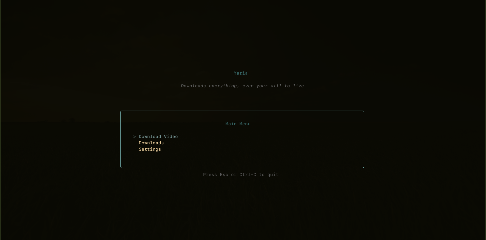

<!-- banner -->
<p align="center">
  
</p>

<h1 align="center">Yaria</h1>

<p align="center">
  <b>Terminal video &amp; audio downloader</b> with a polished TUI<br/>
  Free CLI · shared library for the desktop app · optional Pro builds
</p>

<p align="center">
  <a href="https://yaria.live"></a>
  <a href="https://www.npmjs.com/package/@zsnero/yaria"></a>
  <a href="https://yaria.live/docs"></a>
</p>

<p align="center">
  
  
  
  
</p>

---

## ✨ Demo

<p align="center">
  
</p>
<p align="center"><sub>Interactive TUI · same engine as the <a href="https://github.com/zsnero/yaria-app">desktop app</a></sub></p>

---

## 🧩 What is this repo?

**YariaPlus** = **CLI + shared Go module** used by:

| Consumer | Role |
|:--|:--|
| 🖥️ **Yaria CLI** (`cmd/yaria`) | Terminal app → `yaria` binary |
| 🪟 **YariaApp** | Desktop GUI imports this module |

```text
Projects/
  YariaPlus/   ← you are here (library + CLI)
  YariaApp/    ← desktop (replace yaria => ../YariaPlus)
```

---

## ✨ Features

<table>
<tr>
<td width="50%" valign="top">

### 🆓 Free downloader

- 🎬 **1000+ sites** (yt-dlp)  
- ⚡ **aria2** multi-connection  
- 🎨 Interactive **Bubble Tea** TUI  
- 🎵 Playlists & audio-only  
- 📦 mp4 / mkv / webm  
- 🧵 Background daemon  
- 🍪 Browser cookies  
- 🔧 Auto-install tools  

</td>
<td width="50%" valign="top">

### 💎 Pro (`-tags pro`)

- 🔍 Multi-provider torrent search  
- 📡 Stream & download torrents  
- 📚 Library & watch progress  
- 🔗 APIs for the **desktop** app  

Community builds omit the `pro` tag.

</td>
</tr>
</table>

---

## 🚀 Quick start

```bash
# Interactive menu
yaria

# Download a URL
yaria https://www.youtube.com/watch?v=dQw4w9WgXcQ

# Downloader TUI
yaria download

# Audio only
yaria download --extract-audio https://www.youtube.com/watch?v=...

yaria --help
yaria --version
```

### ⌨️ Commands

| Command | Description |
|:--|:--|
| `yaria` | Main menu |
| `yaria <URL>` | Download shortcut |
| `yaria download` | Format / resolution TUI |
| `yaria download <URL>` | CLI download |
| `yaria <magnet>` | Stream magnet |
| `yaria activate <key>` | Activate Pro |
| `yaria deactivate` | Remove license |
| `yaria status` | License / device info |
| `yaria daemon` | Background downloads |

### TUI keys

| Key | Action |
|:--|:--|
| `↑` / `k` | Up |
| `↓` / `j` | Down |
| `Enter` | Select |
| `Esc` | Back |
| `Ctrl+C` | Quit |

---

## 📦 Install

<details open>
<summary><b>npm</b></summary>

```bash
npm install -g @zsnero/yaria
```

</details>

<details open>
<summary><b>From source</b></summary>

```bash
git clone https://github.com/zsnero/yaria.git
cd yaria

make build        # community → ./yaria
make build-pro    # Pro tag

make install
make install-pro
```

</details>

---

## 🔧 Dependencies (auto-managed)

Prefers **PATH**, otherwise downloads locally:

| Tool | Role |
|:--|:--|
| **yt-dlp** | Extraction |
| **aria2c** | Multi-connection |
| **ffmpeg** | Merge / remux |
| **deno** | JS challenges |
| **mpv** | Optional playback |

<details>
<summary>Manual install if auto-setup fails</summary>

```bash
# Arch
sudo pacman -S yt-dlp aria2 ffmpeg

# Debian / Ubuntu
sudo apt install yt-dlp aria2 ffmpeg

# macOS
brew install yt-dlp aria2 ffmpeg

# Windows
winget install yt-dlp.yt-dlp aria2
```

</details>

---

## ⚙️ Configuration

```text
~/.config/yaria/app.toml
```

Created on first run (legacy `app.yaml` migrates automatically).

| Key area | Use |
|:--|:--|
| `yaria.theme` | TUI theme |
| `mantorex.*` | Data dir, ports (Pro) |
| `ui.*` | Desktop prefs (YariaApp) |
| `network.*` | Proxy, speed limit |
| `api_keys.tmdb` | Optional metadata |

| Path | Use |
|:--|:--|
| `~/.yaria/` | Cache, cookies, tools |
| `~/Downloads/Mantorex` | Default Pro data dir |

---

## 🛠️ Build tags

| Tag | Result |
|:--|:--|
| *(none)* | Community CLI |
| `pro` | CLI + Mantorex packages |

```bash
make build
make build-pro
make run / run-pro
make tidy && make vet
make clean
```

Desktop import:

```go
require yaria v0.0.0

replace yaria => ../YariaPlus
```

### Layout

```text
YariaPlus/
├── cmd/yaria/           # CLI
├── internal/yaria/      # downloader, TUI, daemon
├── internal/appconfig/  # settings
├── internal/mantorex/   # Pro packages
├── pkg/                 # public API for desktop
├── assets/              # README images
├── npm/
└── Makefile
```

---

## 🔐 License & Pro

- Keys via [yaria.live](https://yaria.live)  
- CLI: `activate` · `status` · `deactivate`  
- Community: see [LICENSE](LICENSE)  
- Pro terms: [yaria.live](https://yaria.live)

---

## 🔗 Related

| Project | Role |
|:--|:--|
| **YariaPlus** (this) | CLI + shared library |
| **[YariaApp](https://github.com/zsnero/yaria-app)** | Desktop GUI |

---

<p align="center">
  <br/><br/>
  <b>Fast downloads. Your machine. Your files.</b><br/>
  <a href="https://yaria.live">yaria.live</a>
  ·
  <a href="https://www.npmjs.com/package/@zsnero/yaria">npm</a>
  ·
  <a href="https://yaria.live/docs">docs</a>
</p>
